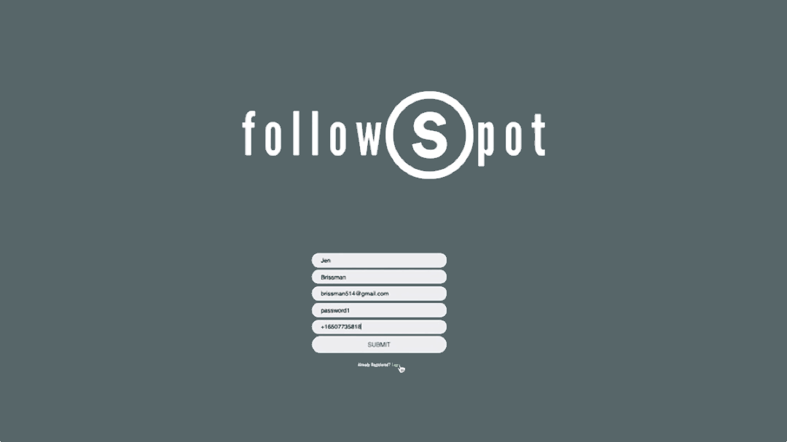
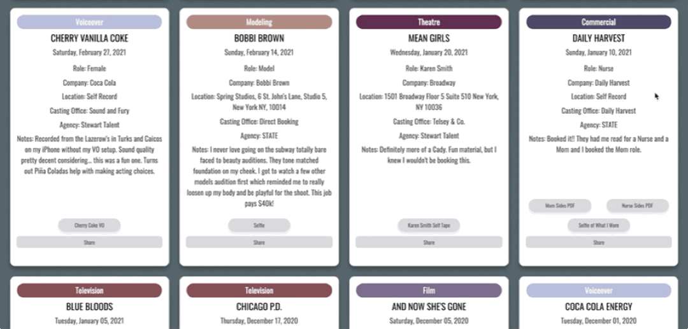
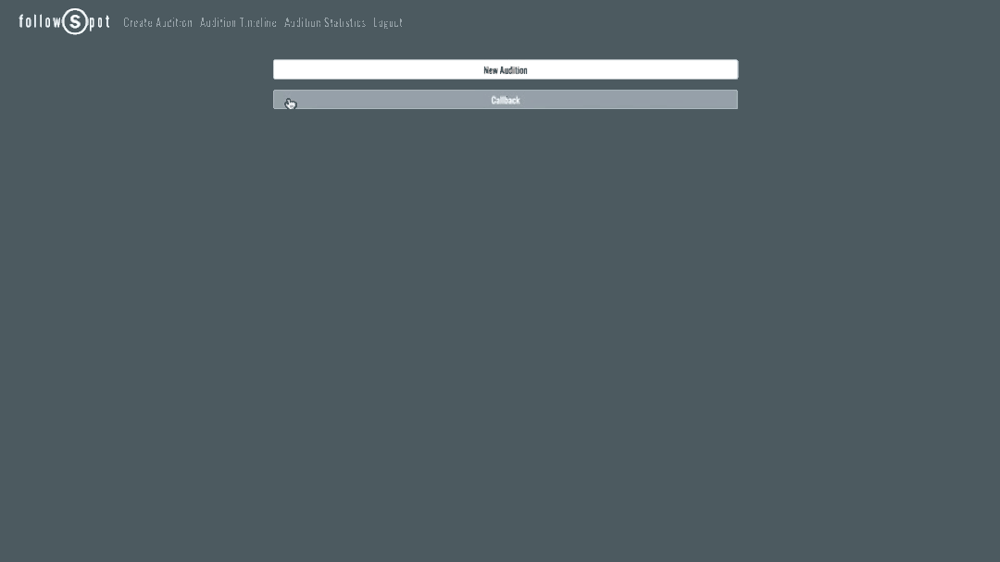
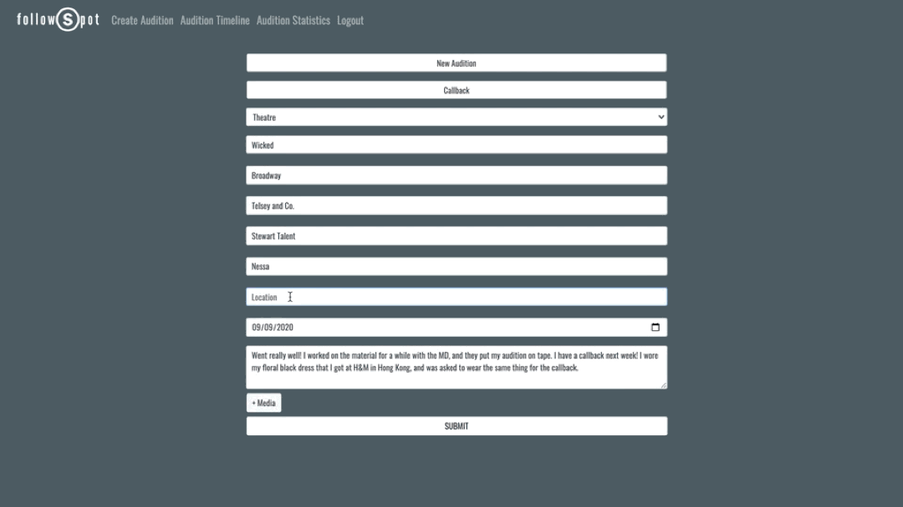
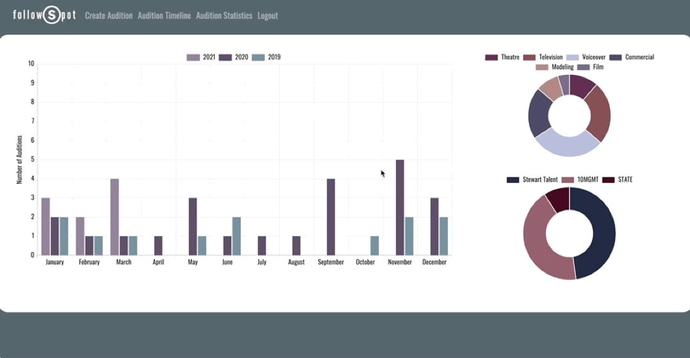
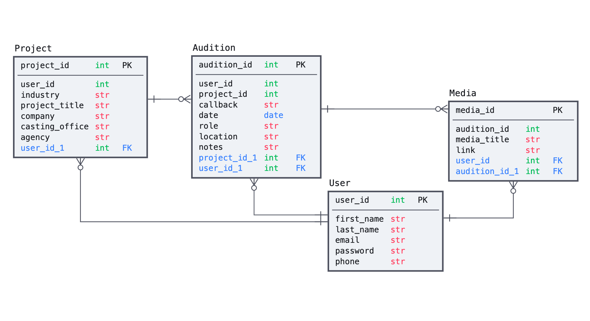
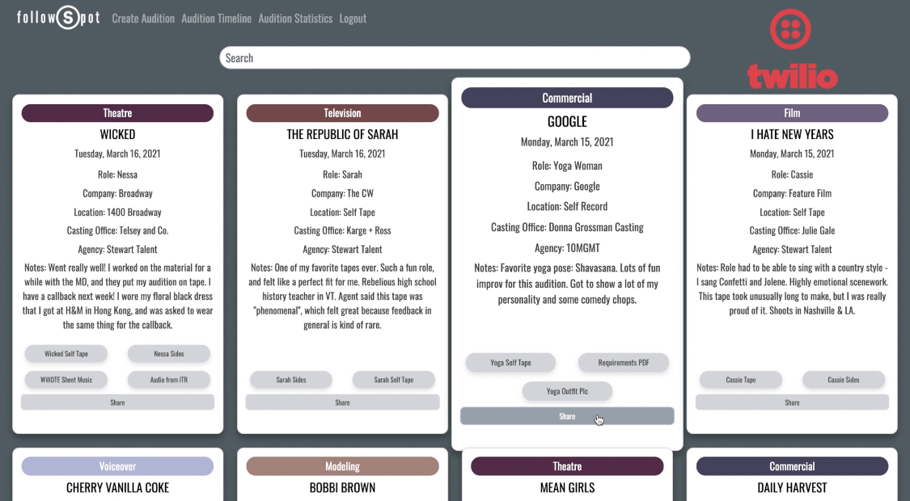

by [Jen Brissman](https://www.linkedin.com/in/jenbrissman/) | [brissman514@gmail.com](mailto:brissman514@gmail.com?subject=[GitHub]%20FollowSpot) | [Watch the demo!](https://www.youtube.com/watch?v=AkxajodTJZs&t=23s)


Table of Contents
------
- [Tech Stack](#Tech)
- [About](#About)
- [Testing](#Testing)
- [Features](#Features)
- [Looking Ahead](#Future)
- [Meet the Developer](#Meet)
- [Acknowledgments](#Acknowledgments)
- [Install](#Install)

## <a name="#Tech"></a>Tech Stack

- **Frontend**: JavaScript | jQuery | HTML5 | CSS | Bootstrap
- **Backend**: Python3 | Flask | SQLAlchemy | Jinja2
- **APIs**: Cloudinary | Twilio | GoogleMaps | Chart.js
- **Database**: PostgreSQL

## <a name="#About"></a>About

FollowSpot is a comprehensive audition tracking full stack web application for entertainment industry professionals. This application allows users to store information and media for all of their auditions while also compiling data and displaying statistics to help track their progress.

## <a name="#Testing"></a>Testing

For my tests, I used [Coverage.py](https://coverage.readthedocs.io/en/coverage-5.5/) as it allows you to see your test coverage.

1. To run coverage, run this command:
```shell
$ coverage run -m unittest discover.
```

2. To see the coverage report, run: 
```shell
$ coverage report -m.
```

## <a name="#Features"></a>Features

## <a name="#Login"></a>Login and Registration
The user will create a personal account to store all of their audition information and materials. I have integrated the Twilio API to send the user an SMS message confirming their connection to the app.



## <a name="#Timeline"></a>Audition Timeline
To develop a responsive and user friendly interface - I styled FollowSpot with Bootstrap and my own custom CSS. I provide the user with a collection of thoughtfully designed cards which contain all of the information about a specific audition. My design uses Jinja templating to dynamically load the data onto individual cards, which I've sorted in reverse chronological order.  



## <a name="#Search"></a>Search Auditions
To filter through the cards, I developed a search feature by adding a JavaScript event listener that evaluates keystrokes to hide the cards that do not contain text matching the query string.


## <a name="#Input"></a>Audition Input
To collect the user's data, I built a responsive form which provides intuitive prompts--he first of which is whether the audition is an initial audition or a callback. When the user clicks the callback button, an on-click event triggers a drop down to appear with previously logged projects, which the user can then select. I implemented jQuery to auto-populate certain text fields with response data returned from my server via a get request made to my API. 



## <a name="#Location"></a>Location and Media
I implemented Google’s Map & Places API with their Place Autocomplete service. In addition, by integrating Cloudinary’s media management API, I am able to offer the user the option of uploading any number or type of media files pertaining to their audition.



## <a name="#Media"></a>View Media
 In order to correctly populate the media table in my database with multiple files, promises returned from both my API and Cloudinary’s needed to be handled in a synchronized manner using a series of async/await fetch requests. I originally wrote this code with a series of nested fetches, but refactoring with async/await allowed me to store the responses in variables, which proved to be very helpful for debugging.
 Update - I now handle the media upload more securely on the backend! See the upload-cloudinary route in my server. 


## <a name="#Audition"></a>Audition Statistics
I used the ChartJS data visualization library to build statistical representations of the user's auditions. The bar chart represents the total number of auditions logged by the user over time, while the two doughnut charts break auditions down by industry and agency. I was able to display the data by month and by year while giving each year its own color by putting the data into a nested object and parsing through it.



## <a name="#Data"></a>Data Model



## <a name="#Future"></a>Looking Ahead
Moving forward, I will be continuing to develop my application’s use of the Twilio API to allow users to better share an audition card via SMS.



## <a name="#Meet"></a>Meet the Developer

A tenacious multi-hyphenate, I am a driven and focused problem solver who has a knack for seeing the bigger picture in any situation. I currently work for Cloudinary as a Software Engineering Tutorial Producer. From 2013-2021, I was the Senior Operations Manager at a private investment office in NYC, where I was promoted twice within the company.

I also have a successful career as a commercial, tv, film, theatre, and voiceover actress and model in New York City. I hold a BFA from the UC-Conservatory of Music, which accepts only the top 1% of applicants for my given major.
I am a contributing member and co-founder of the mentorship program within Artists Who Code, an online community of artists in tech. In my free time, I am an adventurous world traveler who enjoys mountain biking, snowboarding, running, scuba diving, pickleball, and am happiest in hiking boots.

Connect with [Jen Brissman](https://www.linkedin.com/in/jenbrissman/) on LinkedIn!

## <a name="#Troubleshooting"></a>Troubleshooting
If you are trying to reseed the database (never do this in production), it isn't enough to drop the database.
You also need to drop the schema entirely.
- To drop the schema, execute this SQL command: `drop schema public cascade;`
- To recreate the schema, execute this SQL command: `create schema public;`

## <a name="#Acknowledgments"></a>Acknowledgments

#### Mentors
- Anna Peery
- Kerrie Yee
- Kevin Krauss
- Jordan Grubb
- Yaakov Bressler

#### Advisors
- Thu Nguyen
- Kat Huber-Juma
- Lucia Racine

## <a name="#Install"></a>Install

### Running Followspot

1. Clone this repository:
```shell
git clone https://github.com/jenbrissman/FollowSpot.git
```

***Optional***: Create and activate a virtual environment:
```shell
pip3 install virtualenv
virtualenv env
source env/bin/activate
```

2. Install dependencies: 
```shell
pip3 install -r requirements.txt
```

3. Create environmental variables to hold your API keys in a `secrets.sh` file. You'll need to create your own Twilio and Cloudinary API keys:
```
export cloud_name="create your own cloudindary name/account"
export cloud_api_key="once you do this they will provide you a key which you will put here"
export cloud_api_secret="use your own secret of course, shhh"
export twilio_account_sid="create your own twilio account and enter your sid here"
export twilio_auth_token="enter your twilio auth token here"
export twilio_number="+15555555555 enter your assigned twilio # with the +1 format before 10 digit #"
```

4. Create your database & seed sample data:
```shell
createdb followspot
python3 seed.py
```

5. Run the app on localhost:
```shell
source secrets.sh
python3 server.py
```

