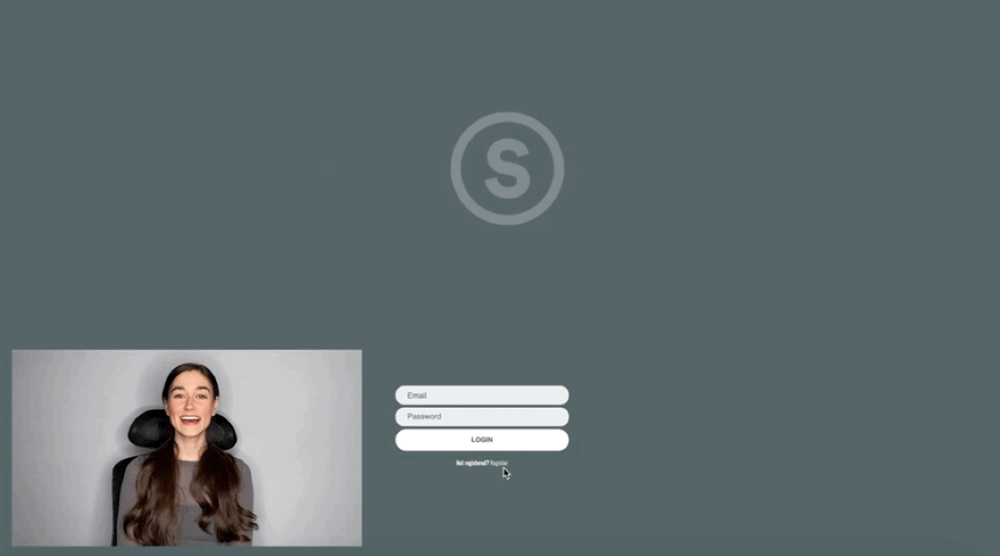
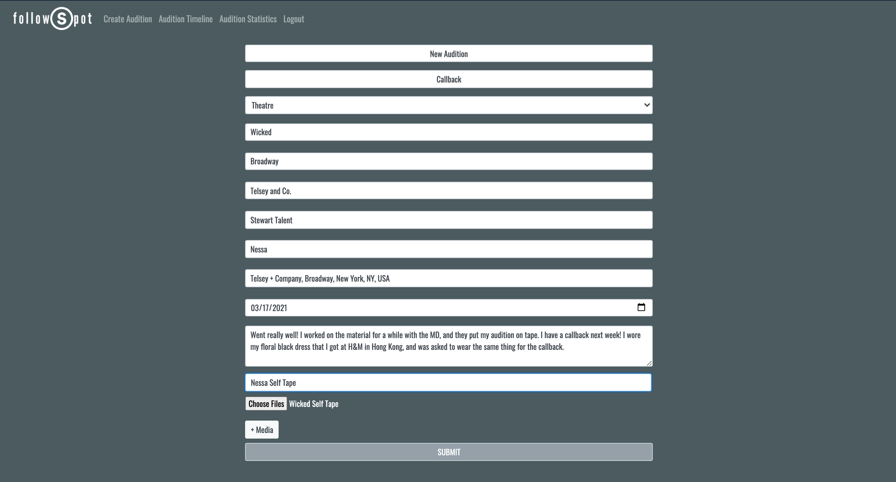
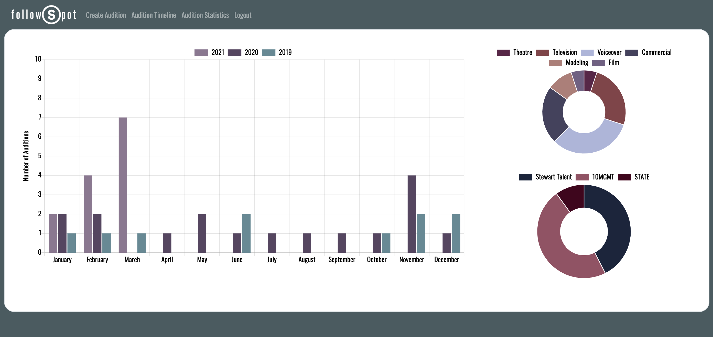

------

[Jen Brissman](https://www.linkedin.com/in/jenbrissman/) | [brissman514@gmail.com](mailto:brissman514@gmail.com?subject=[GitHub]%20FollowSpot) | [Watch the demo!](https://youtu.be/vTcIRON-Vrg)
------

Table of Contents
------
[Tech Stack](#tech-stack) | [Features](#features) | [About](#about) | [Installation](#installation)

Tech Stack
------
| <!-- -->    | <!-- -->    |
|:-------------|:-------------|
| **APIs and Libraries**  | Cloudinary, Twilio, GoogleMaps, Chart.js |
| **Backend**             | Python3, Flask, SQLAlchemy, Jinja2 |
| **Frontend**            | JavaScript, jQuery, HTML5, CSS, Bootstrap |
| **Database**            | PostgreSQL |
| <!-- -->    | <!-- -->    |

Features
------

### Login/Register
- Allow the user to create an account to store all of their audition information and materials

### Audition Timeline
- Complies all the information and displays it cleanly on a timeline feed

### Input Forms

### Audition Statistics
